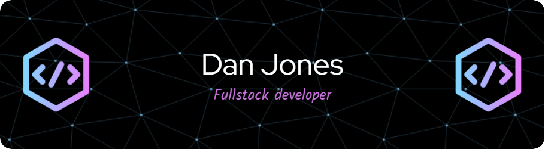

# Dan Jones portfolio project

## Descrption

This is my portfolio website project. Throughout the course of my class I will be making several projects and need a place to showcase them. This website will be where I link all my projects together. 

As well as a portfolio for my projects, I also wanted to create an about me seciton so people could read about me and my goals as a developer.

## Table of Contents

- [Links](#links)
- [API](#api)
- [Contributing](#contributing)
- [License](#license)

## Links

(coming soon)

## API

N/A

## Contributing

N/A

## License

[MIT © Richard McRichface.](../LICENSE)
